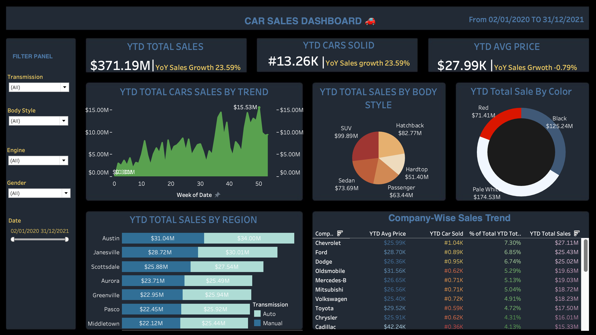

# Tableau Car Sales Analysis 🚗📊

## Project Overview

This project analyzes car sales performance using Tableau.

## Tools Used

- Tableau

## Key Insights

- Analyzed total car sales performance

- Identified sales trends over time

- Compared sales performance across different regions

- Analyzed sales by body style and vehicle color

- Compared company-wise sales performance

- Analyzed average vehicle prices

- Used interactive filters for dynamic analysis

## Dashboard Preview

